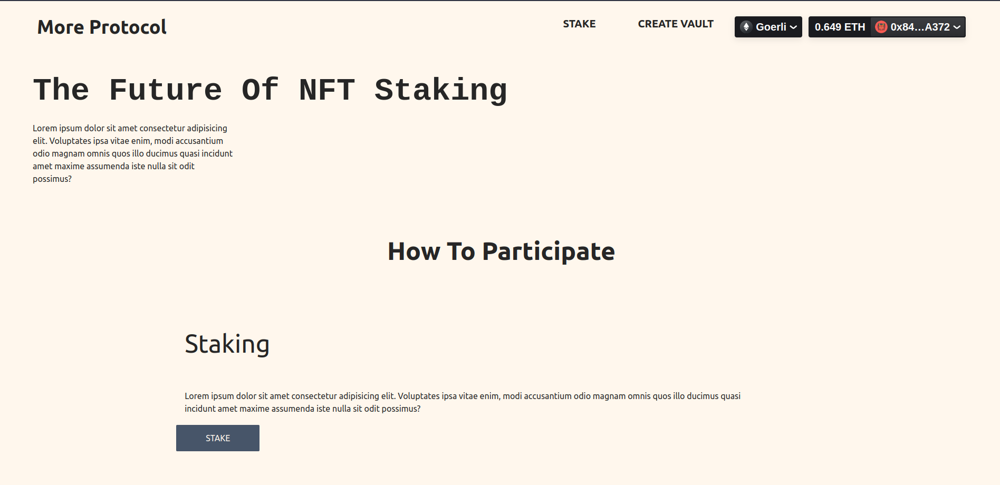
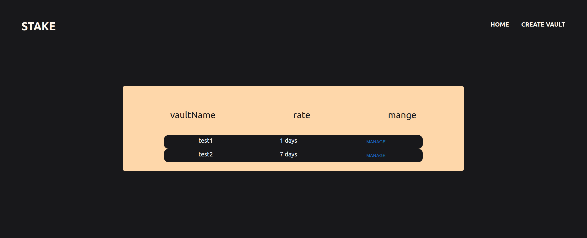

## More Protocol

More Protocol is about NFT staking, where NFTs are Locked for a period of time LOCKUP_TIME and rewards is been calculated based on time rate.
More Protocol helps to buy back NFT liquidity.

  

The Home Page on More Protocol

  

